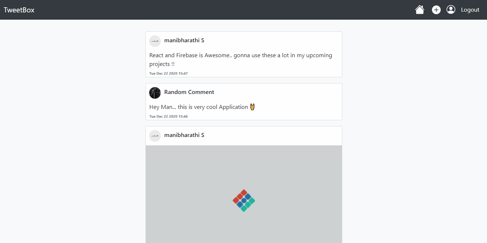

# TweetBox
A Tweeting Web Application developed using React🚀 and Firebase🔥

### Features 
* View, Create, Edit, Delete Tweets.
* Google Authentication for Sign In

### Technology Used
* **React** - Frontend
* **Firebase** - Baas (Backend as a Service)
    1. **Firestore** - NoSQL database
    2. **Authentication** - Google Authentication
    3. **Storage** - Cloud Storage for uploading and saving Images

### Preview

### To run this on Local machine
* Clone the repo, install all the dependcies from package.json
* Create a firebase project and replace all the Project keys in 'src/firebase.js'
* Turn on Google Authentication in your firebase authentication console
* Run app by typing `npm start`in command line

### Note
You will have to create an Index in firestore, as `MyPosts` Componenet uses nested Queries to fetch data. When using the app for first time you will receive a error in console stating you to create an Index in Firestore. That Error will provide a link with it, you can click on the link and create an Index. (This is an One time issue)
